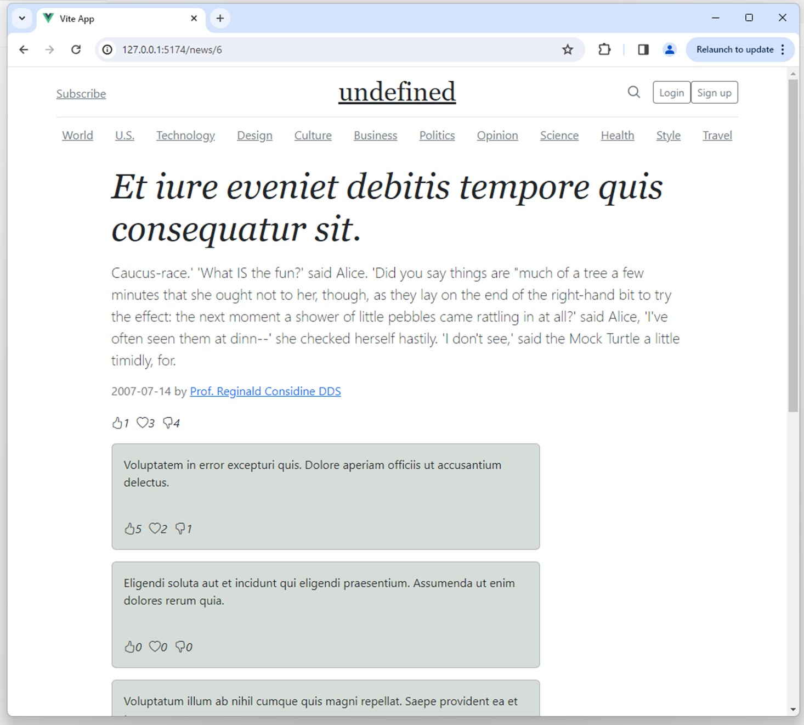

# News Webpage
This project aim to demostrate how News webpage can be developed using Vuejs as Frontend

The backend link of this project is: news_website_laravel_vuejs in josecome repository

Display clicked news

## To run the project

Please type the follow command to run backend app

### `php artisan serve`

And type to run frontend app

### `npm run dev`

Server will run on [http://127.0.0.1:5173]
